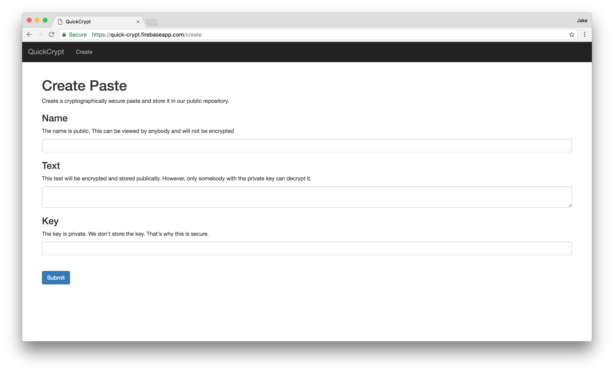

# quick-crypt
Have you ever need to send somebody your SSN but been concerned with the security of your communications? Quick-crypt is pastebin but with encryption.

Checkout the live preview on Firebase hosting: https://quick-crypt.firebaseapp.com

## Example Paste
Here is an example of a secure paste (or what would be a secure paste if the key was not publically available in this README file): https://quick-crypt.firebaseapp.com/view/-Knu9OobhmhI4Fuo4YAG. To view and decrypt the paste, click the link and enter the key `Don'tPostThisPublically`. You should only be able to view the secret message if you enter the correct key.

## Encryption Strategy
Encryption using a password has been abstracted to the `encrytion.service.ts` service. Currently, the service wraps the Stanford encryption library using `sjcl.json.encrypt()` as a simple encryption solution.

## Data Storage Strategy
Since sensitive data in pastes is encrypted, it can be stored publically. As a result, pastes are stored by default in a public firebase. Firebase provides the advantages of free data storage and realtime updates.

## Status
This is currently a work-in-progress repository. As a result, it is lacking in testing, documentation, and styling.

## Other Projects
Checkout my other projects at [http://www.jakebillings.com](http://www.jakebillings.com) or contact me via [LinkedIn](https://www.linkedin.com/in/jake-billings/).
